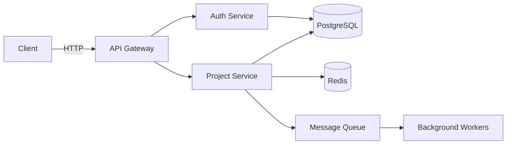
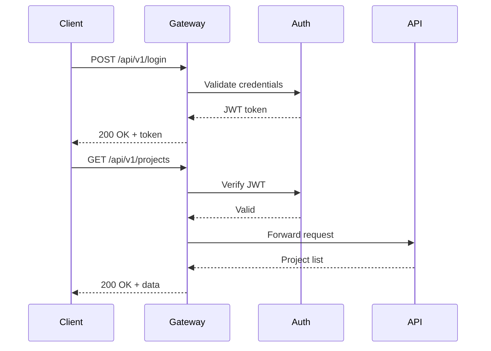
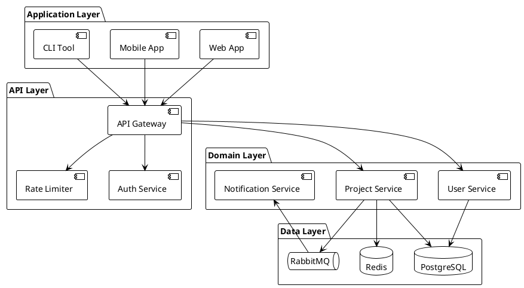
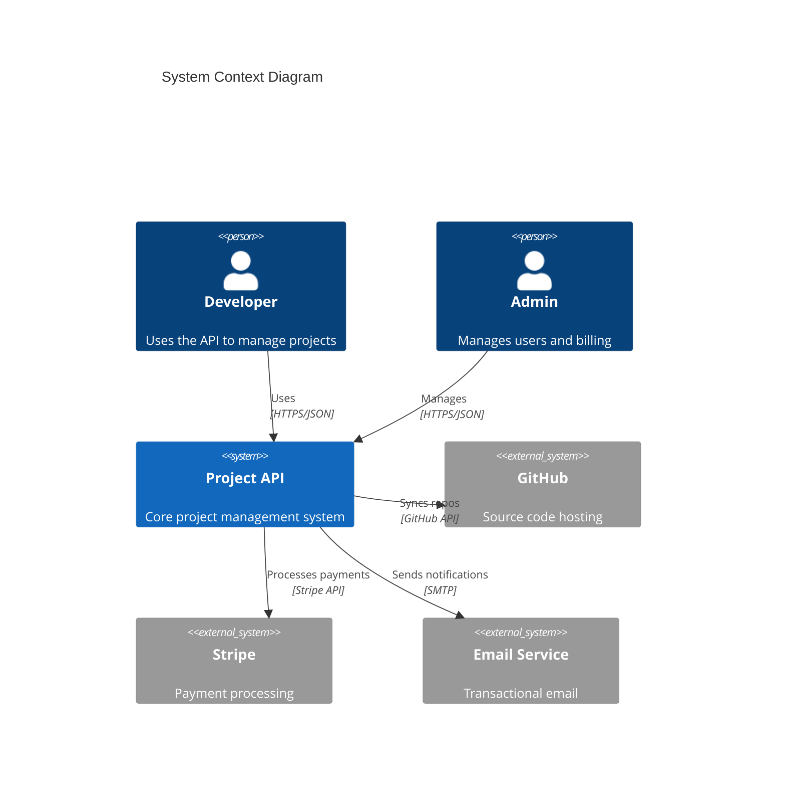

# Documentation Engineer

Comprehensive technical documentation practices for software teams. Covers docs-as-code workflows, API documentation standards, architecture decision records, static site generators, information architecture, writing standards, diagrams, and long-term maintenance strategies.

## Table of Contents

- [1. Docs-as-Code](#1-docs-as-code)
- [2. API Documentation](#2-api-documentation)
- [3. Architecture Decision Records](#3-architecture-decision-records)
- [4. Static Site Generators](#4-static-site-generators)
- [5. Information Architecture](#5-information-architecture)
- [6. Writing Standards](#6-writing-standards)
- [7. Diagrams and Visuals](#7-diagrams-and-visuals)
- [8. Maintenance](#8-maintenance)

---

## When to Use

- Setting up documentation infrastructure for a new project or team
- Writing or reviewing API documentation (REST, GraphQL, event-driven)
- Creating architecture decision records for technical choices
- Configuring a documentation site with Docusaurus, MkDocs, or Starlight
- Designing information architecture and navigation for developer docs
- Establishing writing standards and style guides
- Adding diagrams (Mermaid, PlantUML, C4) to technical documentation
- Auditing existing docs for freshness, broken links, or gaps

---

## 1. Docs-as-Code

Treat documentation with the same rigor as source code: version control, pull request reviews, automated testing, and continuous deployment.

### Core Principles

1. **Version control** — All docs live alongside code in the same repository (or a dedicated docs repo with cross-references)
2. **Plain text formats** — Markdown, AsciiDoc, or reStructuredText; no binary formats in version control
3. **Review workflows** — Pull requests for documentation changes, with designated reviewers
4. **Automated validation** — CI/CD pipelines that lint, build, and deploy docs on every merge
5. **Single source of truth** — Avoid duplicating content; use includes, references, or generated docs

### Repository Structure

```
docs/
  getting-started/
    index.md
    installation.md
    quickstart.md
  guides/
    authentication.md
    deployment.md
  reference/
    api.md
    configuration.md
  architecture/
    decisions/
      001-use-postgres.md
      002-adopt-event-sourcing.md
  contributing.md
  style-guide.md
.vale.ini
.markdownlint.yaml
```

### CI/CD Pipeline for Docs

```yaml
# .github/workflows/docs.yml
name: Documentation
on:
  push:
    branches: [main]
    paths: ['docs/**', '*.md']
  pull_request:
    paths: ['docs/**', '*.md']

jobs:
  lint:
    runs-on: ubuntu-latest
    steps:
      - uses: actions/checkout@v4
      - name: Markdown lint
        uses: DavidAnson/markdownlint-cli2-action@v16
        with:
          globs: 'docs/**/*.md'
      - name: Vale prose lint
        uses: errata-ai/vale-action@v2
        with:
          files: docs/

  build:
    runs-on: ubuntu-latest
    needs: lint
    steps:
      - uses: actions/checkout@v4
      - uses: actions/setup-node@v4
        with:
          node-version: 20
      - run: npm ci
      - run: npm run docs:build
      - name: Check for broken links
        run: npx broken-link-checker-local ./build --recursive

  deploy:
    if: github.ref == 'refs/heads/main'
    runs-on: ubuntu-latest
    needs: build
    steps:
      - uses: actions/checkout@v4
      - run: npm ci && npm run docs:build
      - uses: peaceiris/actions-gh-pages@v4
        with:
          github_token: ${{ secrets.GITHUB_TOKEN }}
          publish_dir: ./build
```

### Linting Tools

**Vale** — Prose linter that enforces style rules:

```ini
# .vale.ini
StylesPath = .vale/styles
MinAlertLevel = suggestion

[docs/*.md]
BasedOnStyles = Vale, Microsoft, write-good
Vale.Terms = YES
Microsoft.Headings = YES
```

**markdownlint** — Structural Markdown linter:

```yaml
# .markdownlint.yaml
default: true
MD013:
  line_length: 120
  tables: false
  code_blocks: false
MD033:
  allowed_elements:
    - details
    - summary
    - br
MD041: false  # Allow non-H1 first line (frontmatter)
```

### Anti-Patterns

```
BAD:  Docs live in a shared wiki with no version history
WHY:  No audit trail, no review process, content drifts from code

BAD:  Docs are Word/PDF files checked into the repo
WHY:  Binary formats cannot be diffed, merged, or linted

BAD:  A single massive README.md for the entire project
WHY:  Impossible to navigate; no separation of concerns

BAD:  Documentation changes bypass pull request review
WHY:  No quality gate; errors and inconsistencies creep in
```

---

## 2. API Documentation

Accurate, interactive API documentation is the primary interface for API consumers. Use specification-driven approaches for consistency and tooling support.

### OpenAPI 3.1

The industry standard for RESTful API documentation.

```yaml
# openapi.yaml
openapi: 3.1.0
info:
  title: Project API
  version: 1.0.0
  description: |
    Core API for project management operations.
    
    ## Authentication
    All endpoints require a Bearer token in the Authorization header.
  contact:
    name: API Support
    email: api-support@example.com

servers:
  - url: https://api.example.com/v1
    description: Production
  - url: https://staging-api.example.com/v1
    description: Staging

paths:
  /projects:
    get:
      operationId: listProjects
      summary: List all projects
      description: |
        Returns a paginated list of projects the authenticated user has access to.
        Results are sorted by `updated_at` descending by default.
      tags:
        - Projects
      parameters:
        - name: page
          in: query
          schema:
            type: integer
            minimum: 1
            default: 1
        - name: per_page
          in: query
          schema:
            type: integer
            minimum: 1
            maximum: 100
            default: 20
        - name: status
          in: query
          schema:
            type: string
            enum: [active, archived, draft]
      responses:
        '200':
          description: Successful response
          content:
            application/json:
              schema:
                type: object
                properties:
                  data:
                    type: array
                    items:
                      $ref: '#/components/schemas/Project'
                  meta:
                    $ref: '#/components/schemas/PaginationMeta'
        '401':
          $ref: '#/components/responses/Unauthorized'

    post:
      operationId: createProject
      summary: Create a new project
      tags:
        - Projects
      requestBody:
        required: true
        content:
          application/json:
            schema:
              $ref: '#/components/schemas/ProjectCreate'
            examples:
              minimal:
                summary: Minimal project
                value:
                  name: My Project
              full:
                summary: Full project details
                value:
                  name: My Project
                  description: A detailed project description
                  status: active
                  team_id: team_abc123
      responses:
        '201':
          description: Project created
          content:
            application/json:
              schema:
                $ref: '#/components/schemas/Project'
        '422':
          $ref: '#/components/responses/ValidationError'

components:
  schemas:
    Project:
      type: object
      required: [id, name, status, created_at]
      properties:
        id:
          type: string
          format: uuid
          example: proj_a1b2c3d4
        name:
          type: string
          maxLength: 255
          example: My Project
        description:
          type: string
          nullable: true
        status:
          type: string
          enum: [active, archived, draft]
        created_at:
          type: string
          format: date-time
        updated_at:
          type: string
          format: date-time

    ProjectCreate:
      type: object
      required: [name]
      properties:
        name:
          type: string
          maxLength: 255
        description:
          type: string
        status:
          type: string
          enum: [active, draft]
          default: draft
        team_id:
          type: string

    PaginationMeta:
      type: object
      properties:
        current_page:
          type: integer
        per_page:
          type: integer
        total_pages:
          type: integer
        total_count:
          type: integer

  responses:
    Unauthorized:
      description: Authentication required
      content:
        application/json:
          schema:
            type: object
            properties:
              error:
                type: string
                example: unauthorized
              message:
                type: string
                example: Invalid or expired token

    ValidationError:
      description: Validation failed
      content:
        application/json:
          schema:
            type: object
            properties:
              error:
                type: string
                example: validation_error
              details:
                type: array
                items:
                  type: object
                  properties:
                    field:
                      type: string
                    message:
                      type: string
```

### AsyncAPI for Event-Driven APIs

```yaml
# asyncapi.yaml
asyncapi: 3.0.0
info:
  title: Project Events
  version: 1.0.0
  description: Event streams for project lifecycle changes.

channels:
  projectCreated:
    address: projects/created
    messages:
      ProjectCreated:
        payload:
          type: object
          properties:
            project_id:
              type: string
              format: uuid
            name:
              type: string
            created_by:
              type: string
            timestamp:
              type: string
              format: date-time

  projectStatusChanged:
    address: projects/status-changed
    messages:
      ProjectStatusChanged:
        payload:
          type: object
          properties:
            project_id:
              type: string
              format: uuid
            previous_status:
              type: string
              enum: [active, archived, draft]
            new_status:
              type: string
              enum: [active, archived, draft]
            changed_by:
              type: string
            timestamp:
              type: string
              format: date-time
```

### Code-First vs Design-First

| Aspect | Code-First | Design-First |
|--------|-----------|--------------|
| Workflow | Write code, generate spec | Write spec, generate code stubs |
| Best for | Internal APIs, rapid prototyping | Public APIs, multi-team contracts |
| Spec accuracy | Always matches implementation | Can drift if not enforced |
| Tooling | Annotations/decorators in code | OpenAPI editors, Stoplight, Swagger Editor |
| Review | Code review includes API changes | Spec review before implementation |
| Risk | Inconsistent design emerges | Spec becomes outdated if not validated |

**Recommendation:** Use design-first for public APIs. Use code-first with spec validation for internal APIs.

### Rendering Tools

- **Redoc** — Clean, three-panel layout; great for public-facing docs
- **Swagger UI** — Interactive try-it-out console; good for internal use
- **Stoplight Elements** — Embeddable API docs component
- **Scalar** — Modern, customizable API reference

### Anti-Patterns

```
BAD:  API docs are manually written prose, not generated from a spec
WHY:  Docs drift from the actual API; consumers hit undocumented behavior

BAD:  No request/response examples in the spec
WHY:  Developers cannot understand the API without concrete examples

BAD:  Using OpenAPI 2.0 (Swagger) for new projects
WHY:  Missing webhooks, JSON Schema alignment, and modern features

BAD:  Documenting internal implementation details in public API docs
WHY:  Leaks internals, confuses consumers, creates coupling
```

---

## 3. Architecture Decision Records

ADRs capture the context, decision, and consequences of significant technical choices. They are immutable once accepted — new decisions supersede old ones rather than editing them.

### When to Write an ADR

- Choosing a database, message broker, or major framework
- Adopting or dropping an architectural pattern (microservices, CQRS, event sourcing)
- Changing authentication/authorization strategy
- Selecting a hosting platform or deployment model
- Any decision that would be hard or expensive to reverse
- Any decision that generates recurring questions from new team members

### MADR Template (Markdown Any Decision Record)

```markdown
# ADR-NNN: Title of Decision

## Status

Accepted | Superseded by ADR-XXX | Deprecated

## Date

YYYY-MM-DD

## Context

What is the issue that we are seeing that is motivating this decision or change?
Describe the forces at play: technical constraints, business requirements,
team capabilities, timeline pressure.

## Decision

What is the change that we are proposing and/or doing?
State the decision clearly and concisely.

## Alternatives Considered

### Alternative A: [Name]
- **Pros:** ...
- **Cons:** ...

### Alternative B: [Name]
- **Pros:** ...
- **Cons:** ...

## Consequences

### Positive
- What becomes easier or possible as a result of this change?

### Negative
- What becomes harder or what trade-offs are we accepting?

### Risks
- What could go wrong and how will we mitigate it?

## References

- Links to RFCs, benchmarks, blog posts, or prior art
```

### Example ADR

```markdown
# ADR-003: Use PostgreSQL for Primary Data Store

## Status

Accepted

## Date

2025-01-15

## Context

The application requires a relational data store for user accounts, projects,
and audit logs. We need ACID transactions, full-text search, and JSONB support
for flexible metadata. The team has strong PostgreSQL experience. Expected
write volume is ~500 TPS at peak.

## Decision

Use PostgreSQL 16 as the primary relational database, hosted on AWS RDS with
Multi-AZ deployment.

## Alternatives Considered

### Alternative A: MySQL 8
- **Pros:** Familiar to some team members, wide hosting support
- **Cons:** Weaker JSONB support, no native full-text search ranking, 
  less advanced indexing (no GIN/GiST equivalent)

### Alternative B: CockroachDB
- **Pros:** Distributed SQL, horizontal scaling built-in
- **Cons:** Higher operational complexity, cost, and latency for our
  current scale; team has no operational experience

## Consequences

### Positive
- Rich JSONB support for flexible metadata without schema migrations
- Excellent full-text search with tsvector eliminates need for Elasticsearch
- Team can move fast with existing PostgreSQL expertise

### Negative
- Vertical scaling limits; will need read replicas or sharding above ~5K TPS
- Vendor lock-in to PostgreSQL-specific features (JSONB operators, extensions)

### Risks
- If write volume exceeds 5K TPS, will need to evaluate Citus or sharding
  strategy within 12 months

## References

- PostgreSQL 16 release notes: https://www.postgresql.org/docs/16/release-16.html
- AWS RDS Multi-AZ: https://docs.aws.amazon.com/AmazonRDS/latest/UserGuide/Concepts.MultiAZ.html
```

### ADR Tooling

- **adr-tools** — CLI for creating and managing ADRs (`adr new "Use PostgreSQL"`)
- **Log4brains** — ADR management with a static site viewer
- **adr-manager** — VS Code extension for browsing and creating ADRs

### ADR Numbering and Lifecycle

```
001-use-postgres.md           # Accepted
002-adopt-event-sourcing.md   # Accepted
003-switch-to-kafka.md        # Accepted, supersedes 002
004-drop-graphql.md           # Deprecated (reversed)
```

Statuses: `Proposed` -> `Accepted` -> optionally `Superseded` or `Deprecated`

### Anti-Patterns

```
BAD:  Editing an existing ADR to change the decision
WHY:  ADRs are immutable records; create a new ADR that supersedes the old one

BAD:  Writing ADRs after the fact, months later
WHY:  Context is lost; the ADR becomes a retroactive justification, not a record

BAD:  ADRs for trivial decisions (variable naming, lint rule tweaks)
WHY:  Noise drowns out the important decisions; reserve ADRs for consequential choices

BAD:  No "Alternatives Considered" section
WHY:  Without alternatives, the reader cannot evaluate whether the decision was sound
```

---

## 4. Static Site Generators

Choose the right documentation platform based on your ecosystem, team skills, and content needs.

### Comparison Matrix

| Feature | Docusaurus | MkDocs Material | Starlight |
|---------|-----------|-----------------|-----------|
| Language | React/JS | Python | Astro |
| Config | docusaurus.config.js | mkdocs.yml | astro.config.mjs |
| Markdown | MDX | Markdown + extensions | MDX |
| Versioning | Built-in | mike plugin | Manual |
| Search | Algolia / local | Built-in (lunr) | Pagefind |
| i18n | Built-in | Plugin | Built-in |
| Best for | React ecosystems, product docs | Python projects, API docs | Astro projects, lightweight docs |

### Docusaurus Setup

```bash
npx create-docusaurus@latest my-docs classic
cd my-docs
npm start
```

```javascript
// docusaurus.config.js
const config = {
  title: 'Project Docs',
  tagline: 'Developer documentation',
  url: 'https://docs.example.com',
  baseUrl: '/',
  
  presets: [
    ['classic', {
      docs: {
        sidebarPath: './sidebars.js',
        editUrl: 'https://github.com/org/repo/edit/main/',
        showLastUpdateTime: true,
        showLastUpdateAuthor: true,
        versions: {
          current: { label: 'Next', path: 'next' },
        },
      },
      blog: false,
    }],
  ],
  
  themeConfig: {
    navbar: {
      title: 'Project',
      items: [
        { type: 'doc', docId: 'intro', position: 'left', label: 'Docs' },
        { type: 'docsVersionDropdown', position: 'right' },
        { href: 'https://github.com/org/repo', label: 'GitHub', position: 'right' },
      ],
    },
    algolia: {
      appId: 'YOUR_APP_ID',
      apiKey: 'YOUR_SEARCH_KEY',
      indexName: 'project-docs',
    },
  },
};
```

### MkDocs Material Setup

```bash
pip install mkdocs-material
mkdocs new my-docs
cd my-docs
mkdocs serve
```

```yaml
# mkdocs.yml
site_name: Project Docs
site_url: https://docs.example.com
repo_url: https://github.com/org/repo

theme:
  name: material
  features:
    - navigation.tabs
    - navigation.sections
    - navigation.expand
    - navigation.top
    - search.suggest
    - search.highlight
    - content.code.copy
    - content.tabs.link
  palette:
    - scheme: default
      primary: indigo
      toggle:
        icon: material/brightness-7
        name: Switch to dark mode
    - scheme: slate
      primary: indigo
      toggle:
        icon: material/brightness-4
        name: Switch to light mode

plugins:
  - search
  - git-revision-date-localized:
      type: timeago
  - minify:
      minify_html: true

markdown_extensions:
  - admonition
  - pymdownx.details
  - pymdownx.superfences:
      custom_fences:
        - name: mermaid
          class: mermaid
          format: !!python/name:pymdownx.superfences.fence_code_format
  - pymdownx.tabbed:
      alternate_style: true
  - pymdownx.highlight:
      anchor_linenums: true
  - toc:
      permalink: true

nav:
  - Home: index.md
  - Getting Started:
    - Installation: getting-started/installation.md
    - Quick Start: getting-started/quickstart.md
  - Guides:
    - Authentication: guides/authentication.md
    - Deployment: guides/deployment.md
  - API Reference: reference/api.md
  - Architecture Decisions: architecture/decisions/index.md
```

### Starlight Setup

```bash
npm create astro@latest -- --template starlight my-docs
cd my-docs
npm run dev
```

```javascript
// astro.config.mjs
import { defineConfig } from 'astro/config';
import starlight from '@astrojs/starlight';

export default defineConfig({
  integrations: [
    starlight({
      title: 'Project Docs',
      social: { github: 'https://github.com/org/repo' },
      sidebar: [
        { label: 'Getting Started', items: [
          { label: 'Installation', slug: 'getting-started/installation' },
          { label: 'Quick Start', slug: 'getting-started/quickstart' },
        ]},
        { label: 'Guides', autogenerate: { directory: 'guides' } },
        { label: 'Reference', autogenerate: { directory: 'reference' } },
      ],
      editLink: {
        baseUrl: 'https://github.com/org/repo/edit/main/',
      },
    }),
  ],
});
```

### Versioning Strategy

```
docs/
  versioned_docs/
    version-1.0/
    version-2.0/
  docs/               # Current (next) version
  versions.json       # ["2.0", "1.0"]
```

**When to version:**
- Public API with external consumers who cannot upgrade immediately
- Major breaking changes that require migration guides
- Regulatory or compliance contexts where historical docs must be preserved

**When NOT to version:**
- Internal docs with a single consumer team
- Tutorials and guides that always reflect the latest state
- Architecture decisions (they are inherently versioned by numbering)

### Anti-Patterns

```
BAD:  Custom-built documentation framework
WHY:  Maintenance burden; established tools have better search, a11y, and community

BAD:  No search functionality on the docs site
WHY:  Users cannot find content; they will ping Slack instead of reading docs

BAD:  Versioning every minor release
WHY:  Version explosion; maintain only major versions with breaking changes

BAD:  No "Edit this page" link
WHY:  Friction for contributors; easy edits should be one click away
```

---

## 5. Information Architecture

Structure content so that readers find what they need quickly, whether they are browsing, searching, or following a link from an error message.

### The Four Types of Documentation

Based on the Diataxis framework:

| Type | Purpose | Example |
|------|---------|---------|
| **Tutorials** | Learning-oriented; guided experience | "Build your first app" |
| **How-to Guides** | Task-oriented; solve a specific problem | "How to configure SSO" |
| **Reference** | Information-oriented; accurate, complete | API endpoints, config options |
| **Explanation** | Understanding-oriented; provide context | "Why we chose event sourcing" |

### Content Hierarchy

```
Level 0: Landing page / docs home
  - Clear value proposition
  - Quick links to the four content types
  - Search bar prominently placed

Level 1: Section landing pages
  - Getting Started (tutorial)
  - Guides (how-to)
  - API Reference (reference)
  - Architecture (explanation)

Level 2: Individual pages
  - Each page covers one topic or task
  - Consistent structure within its type
  - Cross-links to related pages

Level 3: Page sections
  - Scannable headings (H2, H3)
  - Code examples adjacent to explanations
  - Callouts for warnings and tips
```

### Navigation Design

**Top navigation** — Major sections (Docs, API, Blog, Community)

**Sidebar navigation** — Hierarchical tree within a section:
- Group related pages under descriptive headings
- Limit nesting to 3 levels maximum
- Show the reader's current location (active state)
- Allow collapse/expand for large sections

**Breadcrumbs** — Show path from root: `Docs > Guides > Authentication > OAuth Setup`

**In-page navigation** — Table of contents for pages longer than 3 screens

### Progressive Disclosure

Reveal complexity gradually:

1. **Start with the common case** — Show the simplest working example first
2. **Use expandable sections** — Hide advanced configuration behind `<details>` tags
3. **Link to depth** — "For advanced configuration, see [Configuration Reference](./reference/config.md)"
4. **Layer examples** — Basic example first, then add options progressively

```markdown
## Quick Start

The simplest way to get started:

\`\`\`bash
npx create-app my-project
cd my-project
npm start
\`\`\`

<details>
<summary>Advanced: Custom configuration</summary>

To customize the build pipeline, create a `config.yaml`:

\`\`\`yaml
build:
  target: es2022
  sourcemap: true
  minify: true
\`\`\`

</details>
```

### Audience Analysis

Before writing, identify your readers:

| Audience | Needs | Content Style |
|----------|-------|---------------|
| New developers | Quick wins, copy-paste examples | Tutorials with screenshots |
| Experienced developers | API details, edge cases | Reference docs, code samples |
| Architects | System design, trade-offs | Explanation, ADRs, diagrams |
| Operators | Deployment, monitoring, troubleshooting | Runbooks, how-to guides |
| Managers | Capabilities, roadmap, costs | Overview pages, comparison tables |

### Anti-Patterns

```
BAD:  One giant page with everything
WHY:  Overwhelming; readers cannot find or link to specific sections

BAD:  Mixing tutorials and reference in the same page
WHY:  Different audiences, different reading patterns; separate them

BAD:  Navigation that mirrors the internal code structure
WHY:  Users think in tasks, not modules; organize by user intent

BAD:  Requiring readers to read pages in order
WHY:  Most readers land via search; every page should stand alone
```

---

## 6. Writing Standards

Consistent, clear technical writing reduces support burden and improves developer experience.

### Style Guide Essentials

**Voice and tone:**
- Use second person ("you") to address the reader
- Use active voice: "The server returns a 404 error" not "A 404 error is returned"
- Be direct and concise; remove filler words
- Use present tense: "This command creates a file" not "This command will create a file"

**Formatting conventions:**
- Use **bold** for UI elements: Click **Save**
- Use `code font` for: file names, paths, commands, variables, status codes, and inline code
- Use > blockquotes for important notes and warnings
- Use numbered lists for sequential steps; bullet lists for unordered items

**Headings:**
- Use sentence case: "Configure the database" not "Configure The Database"
- Make headings descriptive: "Set up authentication" not "Authentication"
- Do not skip heading levels (H1 -> H3 without H2)

### Writing for Developers

**Lead with the goal:**

```
GOOD: "To deploy to production, run the following command:"
BAD:  "The deployment system uses a blue-green strategy with..."
```

**Show, then explain:**

```markdown
## Create a new endpoint

\`\`\`python
@app.get("/api/v1/health")
def health_check():
    return {"status": "ok"}
\`\`\`

The `@app.get` decorator registers a GET handler at the specified path.
The function returns a dictionary that FastAPI serializes to JSON.
```

**Use realistic examples:**

```
GOOD: curl -H "Authorization: Bearer sk_live_abc123" https://api.example.com/v1/users
BAD:  curl -H "Authorization: Bearer TOKEN" https://api.example.com/v1/RESOURCE
```

### Code Sample Standards

- Every code sample must be complete enough to copy-paste and run (or clearly marked as a fragment)
- Include the language identifier in fenced code blocks for syntax highlighting
- Show expected output when it aids understanding
- Keep samples under 30 lines; link to full examples for complex scenarios
- Test code samples in CI to prevent them from going stale

```markdown
\`\`\`python title="create_project.py"
import requests

response = requests.post(
    "https://api.example.com/v1/projects",
    headers={"Authorization": "Bearer sk_live_abc123"},
    json={"name": "My Project", "status": "active"},
)

print(response.status_code)  # 201
print(response.json()["id"])  # proj_a1b2c3d4
\`\`\`
```

### Inclusive Language

| Avoid | Use Instead |
|-------|-------------|
| whitelist / blacklist | allowlist / denylist |
| master / slave | primary / replica, leader / follower |
| sanity check | validation, confidence check |
| dummy value | placeholder, sample value |
| he / she (generic) | they, the user, the developer |
| simple / easy / just | (remove or rewrite; what is simple for you may not be for the reader) |

### Anti-Patterns

```
BAD:  "Simply run the command and it should work"
WHY:  "Simply" and "should" undermine confidence; state what WILL happen

BAD:  Placeholder-heavy examples: "Replace YOUR_TOKEN with your token"
WHY:  Readers miss placeholders; use realistic but clearly fake values

BAD:  Long paragraphs of prose explaining a configuration option
WHY:  Use a table or definition list; developers scan, they do not read linearly

BAD:  Outdated screenshots of UI that has changed
WHY:  Screenshots rot fast; prefer text instructions with screenshots as supplements
```

---

## 7. Diagrams and Visuals

Diagrams clarify architecture, flows, and relationships that are hard to convey in prose. Use diagram-as-code tools so diagrams are versioned, diffable, and reproducible.

### Mermaid

Widely supported (GitHub, GitLab, Docusaurus, MkDocs, Notion). Best for quick diagrams.



**Sequence diagram:**



### PlantUML

More powerful than Mermaid for complex UML diagrams. Requires a renderer.



### D2

Modern diagram-as-code language with clean syntax and auto-layout.

```d2
direction: right

client: Client App {
  shape: rectangle
}

gateway: API Gateway {
  auth: Authentication
  rate: Rate Limiting
}

services: Services {
  projects: Project Service
  users: User Service
  notifications: Notification Service
}

data: Data Stores {
  pg: PostgreSQL {
    shape: cylinder
  }
  redis: Redis {
    shape: cylinder
  }
  mq: RabbitMQ {
    shape: queue
  }
}

client -> gateway
gateway.auth -> services.projects
gateway.auth -> services.users
services.projects -> data.pg
services.projects -> data.redis
services.projects -> data.mq
services.users -> data.pg
data.mq -> services.notifications
```

### C4 Model

A systematic approach to diagramming software architecture at four levels:

| Level | Shows | Audience |
|-------|-------|----------|
| **Context (C1)** | System and its external actors | Everyone |
| **Container (C2)** | Applications, data stores, services | Technical team |
| **Component (C3)** | Components within a container | Developers |
| **Code (C4)** | Classes and interfaces | Developers (rarely needed) |

**C4 Context diagram in Mermaid:**



### When to Use Each Tool

| Scenario | Recommended Tool |
|----------|-----------------|
| Quick flow or sequence diagram in a README | Mermaid |
| Detailed UML (class, state, activity) | PlantUML |
| Architecture overview with clean aesthetics | D2 |
| Stakeholder-facing system overview | C4 with Structurizr or Mermaid |
| Database schema (ER diagram) | Mermaid or dbdiagram.io |
| Network topology | D2 or draw.io |

### Anti-Patterns

```
BAD:  Diagrams as exported PNG files with no source
WHY:  Cannot be updated, diffed, or regenerated; they rot instantly

BAD:  One diagram that shows everything
WHY:  Too complex to read; use C4 levels to separate concerns

BAD:  Diagrams with no legend or labels
WHY:  Readers guess what boxes and arrows mean; always label

BAD:  Using a diagramming tool the team cannot edit
WHY:  Only the original author can update it; prefer text-based tools
```

---

## 8. Maintenance

Documentation without maintenance becomes misleading documentation. Establish processes to keep docs accurate and useful over time.

### Freshness Checks

Schedule regular reviews to catch stale content:

```yaml
# .github/workflows/docs-freshness.yml
name: Documentation Freshness Check
on:
  schedule:
    - cron: '0 9 1 * *'  # First of every month

jobs:
  check-freshness:
    runs-on: ubuntu-latest
    steps:
      - uses: actions/checkout@v4
        with:
          fetch-depth: 0
      - name: Find stale docs
        run: |
          echo "## Stale Documentation Report" > report.md
          echo "Files not updated in 180+ days:" >> report.md
          echo "" >> report.md
          git log --all --diff-filter=M --name-only --pretty=format: \
            --since="180 days ago" -- 'docs/**/*.md' | sort -u > recent.txt
          find docs -name '*.md' | sort > all.txt
          comm -23 all.txt recent.txt >> report.md
      - name: Create issue
        uses: peter-evans/create-issue-from-file@v5
        with:
          title: "Monthly docs freshness report"
          content-filepath: report.md
          labels: documentation,maintenance
```

### Link Validation

Check for broken internal and external links:

```yaml
# In your CI pipeline
- name: Check links
  run: |
    npx broken-link-checker-local ./build \
      --recursive \
      --exclude-external \
      --filter-level 3
```

**Tools:**
- **lychee** — Fast link checker written in Rust; supports Markdown, HTML, and more
- **markdown-link-check** — Focused on Markdown files; runs in CI
- **broken-link-checker-local** — Checks a built static site

```yaml
# lychee.toml
exclude = [
  "localhost",
  "example\\.com",
  "127\\.0\\.0\\.1"
]
max_concurrency = 16
timeout = 30
accept = [200, 204, 301, 302]
```

### Analytics and Feedback

Track what readers use and where they struggle:

**Page-level analytics:**
- Most visited pages (focus quality efforts here)
- Pages with high bounce rates (content may not match expectations)
- Search queries with no results (content gaps)
- Time on page (very short = not useful; very long = possibly confusing)

**Feedback mechanisms:**
- "Was this page helpful?" thumbs up/down on every page
- "Edit this page" link to the source file on GitHub
- Dedicated feedback channel (Slack, GitHub Discussions, or a form)
- Issue template for documentation bugs

```markdown
<!-- Add to page footer template -->
---

**Was this page helpful?**
[Yes](https://docs.example.com/feedback?page={{page.url}}&helpful=yes) |
[No](https://docs.example.com/feedback?page={{page.url}}&helpful=no)

Found an error? [Edit this page on GitHub]({{page.edit_url}}).
```

### Content Lifecycle

```
DRAFT ──> REVIEW ──> PUBLISHED ──> MAINTAINED ──> DEPRECATED ──> ARCHIVED
                         │              │
                         └── UPDATE ────┘
```

**Published** — Actively maintained; shown in navigation and search

**Deprecated** — Still accessible but marked with a banner:

```markdown
:::warning Deprecated
This guide applies to v1.x. For v2.x, see [Updated Guide](./new-guide.md).
:::
```

**Archived** — Removed from navigation but still accessible via direct URL; excluded from search

### Documentation Ownership

Assign clear ownership to prevent the "tragedy of the commons":

| Content Area | Owner | Review Cadence |
|-------------|-------|----------------|
| API Reference | Backend team | Every release |
| Getting Started | Developer experience team | Quarterly |
| Architecture Decisions | Engineering leads | Per decision |
| Deployment Guides | Platform/SRE team | Monthly |
| Style Guide | Documentation lead | Biannually |

### Deprecation Process

1. Add a deprecation banner with the date and link to the replacement
2. Remove from primary navigation (keep in sitemap)
3. Exclude from search index after 90 days
4. Add `noindex` meta tag after 180 days
5. Archive or delete after 1 year (redirect URL to replacement)

### Anti-Patterns

```
BAD:  No process for reviewing or updating existing docs
WHY:  Docs decay; after 6 months without review, accuracy drops sharply

BAD:  Deleting pages without redirects
WHY:  External links and bookmarks break; search engines show 404s

BAD:  No analytics on the docs site
WHY:  You cannot improve what you do not measure; analytics reveal gaps

BAD:  Documentation owned by "everyone" (meaning no one)
WHY:  Diffuse responsibility means nothing gets updated; assign explicit owners
```

---

## Output Format

When applying this skill, produce documentation that follows these standards:

1. **File placement** — Docs in `docs/` directory, ADRs in `docs/architecture/decisions/`
2. **Frontmatter** — Every page has YAML frontmatter with `title`, `description`, and optional `sidebar_position`
3. **Structure** — Follows the Diataxis type appropriate to the content
4. **Code samples** — Complete, syntax-highlighted, with realistic values
5. **Diagrams** — Mermaid by default (widest rendering support), source checked in alongside the doc
6. **Cross-references** — Relative links between docs; no absolute URLs to the same site
7. **Review** — All doc changes go through pull request review with at least one reviewer
